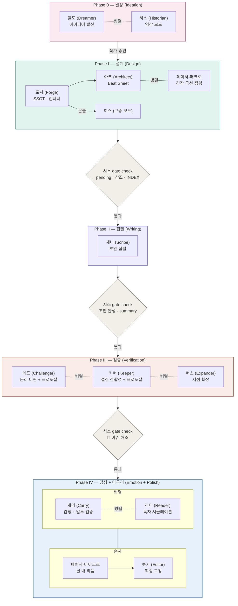
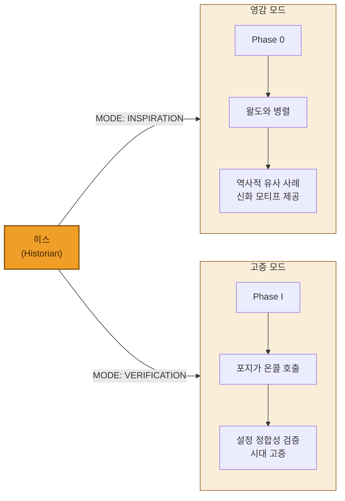
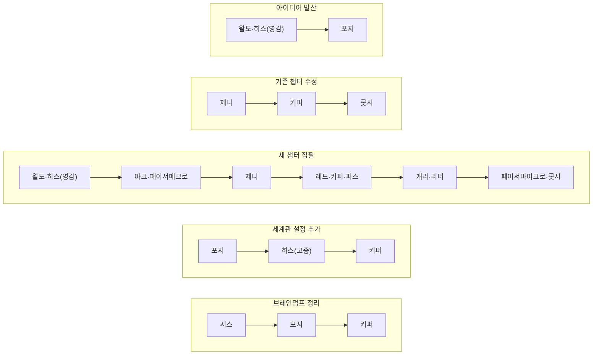

# 에이전트 파이프라인 v3 — 워크플로우 다이어그램

> 옵시디언에서 열면 Mermaid 다이어그램이 자동 렌더링됩니다.

---

## 전체 파이프라인

---

## 히스 이중 모드

---

## 축약 워크플로우

---

## 에이전트 목록

| # | 에이전트 | 파일 | 그룹 | Phase |
|---|---------|------|------|-------|
| 1 | 포지 (World Forge) | `world_forge.md` | 설계 | I |
| 2 | 아크 (Architect) | `architect.md` | 설계 | I |
| 3 | 히스 (Historian) | `historian.md` | 설계 | 0 + I(온콜) |
| 4 | 제니 (Scribe) | `scribe.md` | 집필 | II |
| 5 | 페이서-매크로 | `pacemaker_macro.md` | 집필 | I |
| 6 | 페이서-마이크로 | `pacemaker_micro.md` | 집필 | IV |
| 7 | 쿳시 (Editor) | `editor.md` | 집필 | IV |
| 8 | 레드 (Challenger) | `challenger.md` | 검증 | III |
| 9 | 키퍼 (Keeper) | `keeper.md` | 검증 | III |
| 10 | 퍼스 (Expander) | `expander.md` | 검증 | III |
| 11 | 왈도 (Dreamer) | `dreamer.md` | 확장 | 0 |
| 12 | 캐리 (Carry) | `carry.md` | 감성 | IV |
| 13 | 리더 (Reader) | `reader.md` | 감성 | IV |
| — | 시스 (Systems) | `systems.md` | 인프라 | 전 Phase 게이트 |
